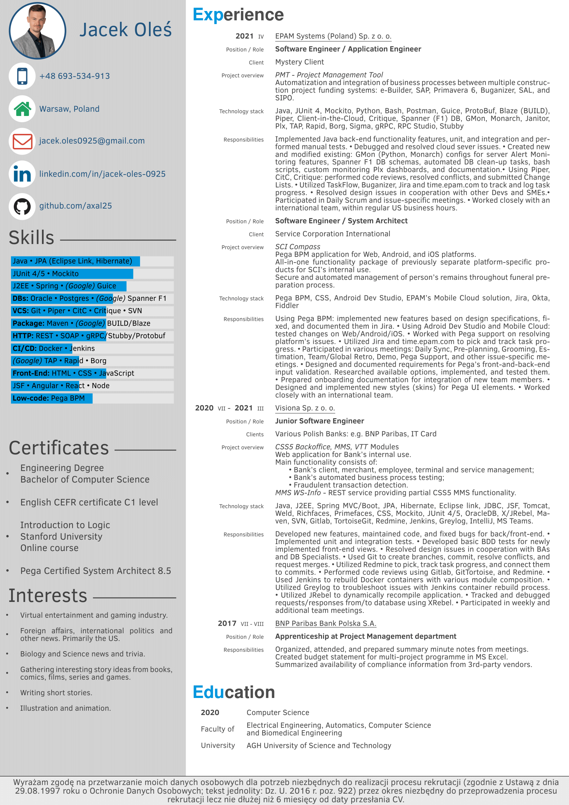

# Curriculum Vitae - Jacek Oleś
## Description
Personal Curriculum Vitae created in LaTeX (pdflatex) based on 2 templates.
Two versions: English and Polish (deprecated: not kept up-to-date).
## Sources
1. [Harsh Gadgil's Data-Engineer-Resume-LaTeX](https://github.com/opensorceror/Data-Engineer-Resume-LaTeX)
2. [Twenty Seconds Resume/CV](https://www.latextemplates.com/template/twenty-seconds-resumecv)
## Preview

## Licence
Copyright 2019 Jacek Oleś

Licensed under the Apache License, Version 2.0 (the "License");
you may not use this file except in compliance with the License.
You may obtain a copy of the License at

   http://www.apache.org/licenses/LICENSE-2.0

Unless required by applicable law or agreed to in writing, software
distributed under the License is distributed on an "AS IS" BASIS,
WITHOUT WARRANTIES OR CONDITIONS OF ANY KIND, either express or implied.
See the License for the specific language governing permissions and
limitations under the License.

### Git

1. Clone remote repository to local drive  
   `git clone https://github.com/axal25/CV.git`
2. Make changes
3. Add changes to the index  
   `git add .`
4. Verify the added changes  
   `git status`
6. Commit changes with message  
   `git commit -m 'msg'`
7. Verify commited changes  
   `git status`
8. Push changes made to remote repository branch called **master**    
   `git push -u origin master`

### Pass

1. Copy token to clipboard  
   `pass -c Git/axal25`
